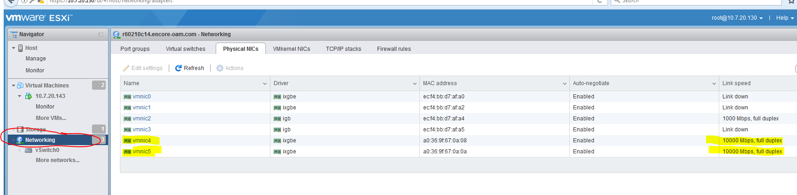

## Create a boot strap server which will host Esxi6.0 as well as vCenter6.0 


**Prerequisites: The host that we are going to boot strap should'be been already executed with the playbooks from [ansible-racadm](https://github.com/misteryiz/ansible-racadm).**


> **Make sure the Anisble control machine can reach internet (because we need to install some yum packages as well as pip packages). [A working yum proxy and  a general https proxy is good enough. For yum proxy, update yum.conf and for the https proxy, at the command line, type `export https://<proxy_server>:<port_number>`.].**

> **We need to have the following ISO files. [ Download them from the dal01kck0001 server ]. Please download them to the Ansible control machine `/tmp` directory.**
* Dell Esxi 6.0 OS : `VMware-VMvisor-Installer-6.0.0.update03-5224934.x86_64-DellEMC_Customized-A03.iso`
* VCenter 6.0 (VCSA) : `VMware-VCSA-all-6.0.0-5326177.iso`

> **Please place all the below directories in to Ansible control machine location `/home/ansible/roles/`. [Do not replace the existing roles.]** [ Download them from the dal01kck0001 server.]
* python2714
* nfs-server
* bootstrap_esxi_idrac
* deployvcsa
* ovf_deploy

> **Please place all the below playbooks in to Ansible control machine location `/home/ansible/playbooks/`. [Do not replace the existing playbooks.]** [ Download them from the dal01kck0001 server.]
* python_2714.yml
* nfs.yml
* bootstrap_esxihost.yml
* deploy_vcsa.yml
* ovf_deploy.yml

> **Please copy `vars` directory (which contains the following files) in to Ansible control machine location `/home/ansible/vars/`. [Do not replace the existing files.]** [ Download them from the dal01kck0001 server.]
* vars/python2714.yml `->` /home/ansible/vars/
* nfs-exports.yml
* bootstrap_esxi_idrac.yml
* deployvcsa.yml
* ovf_deploy.yml

* **Place the contents of `hosts_prod` in to the existing file `/home/ansible/inventory/hosts_prod` file. [Do not Replace the existing file contents. Instead add the content as shown in the file to the respective places, If the below lines doesn't exist.]**

Follow the below format.
```
[bootstrap_host]
#idrachost1 ansible_host=<IP ADDRESS of idrachost1> idrac_racname=<idrachost1 name from DNS> model=<idrachost1 SERVER MODEL>
```

```yaml
[all:children]
r620_servers
r730_servers
mgmt_servers
bootstrap_host   <-- add this line

[bootstrap_host]  <-- add this line
r60210c14-bmc ansible_host=10.231.9.28 idrac_racname=r60210c14-bmc model=630   <-- add this line and change the values accrodingly.

[bootstrap_host:vars]                 <-- add this line
ansible_ssh_pass=<IDRAC_PASSWORD>     <-- add this line and replace with actual idrac password
ansible_ssh_user=root                 <-- add this line

[mgmt_servers]
..
..


```
**Also, update the file `/home/ansible/inventory/hosts_prod` at the end to have the below lines.**

```yml
[local]
localhost ansible_connection=local
```

* **Change the `/home/ansible/vars/nfs-exports.yml` file to reflect the IP Addresses from where you can access the NFS-Share. This is to share the ESXI ISO for boot strap over the iDrac.**

**copy this line `"/var/tmp/nfs_esxi_share  <IDRAC IP ADDRESS RANGE/SUBNET_PREFIX>(rw,sync,no_root_squash,no_subtree_check)",` inside the `nfs_exports` if you want to add more NFS shares by replacing with approriate share names and IP addresses.**

Example:
```yml
nfs_exports: [
"/var/tmp/nfs_esxi_share  <IDRAC IP ADDRESS RANGE/SUBNET_PREFIX>(rw,sync,no_root_squash,no_subtree_check)",
"/var/tmp/nfs_esxi_share  10.231.7.0/24(rw,sync,no_root_squash,no_subtree_check)",
]

```

* **Change the `/home/ansible/vars/bootstrap_esxi_idrac.yml` file to reflect the NFS SHARE IP and BOOT STRAP Host details. These details will be used in creating the ESXI boot strap ISO. These parameters are used to access the ESXi Host once the installation is done.**

`Refer to the vars/bootstrap_esxi_idrac_EXAMPLE.yml file above.`

```yml
nfs_share_ipaddr: '<NFS SHARE HOST IP[which is the IP of Ansible Conotrol Machine]>'

bs_mgmt_host: '<BOOT_STRAP_HOSTNAME>'
bs_mgmt_ip: '<BOOT_STRAP_MANAGEMENT_IP>'
bs_mgmt_mask: '<BOOT_STRAP_MANAGEMENT_IP_SUBNET>'
bs_mgmt_gw: '<BOOT_STRAP_MANAGEMENT_GATEWAY>'
bs_mgmt_domain: '<DOMAIN_NAME>'
bs_mgmt_pdns: '<PRIMARY_DNS>'
bs_mgmt_sdns: '<SECONDARY_DNS>'
bs_mgmt_vlan: <MANAGEMENT_VLAN>
bs_mgmt_portgroup: '<MANAGEMENT_PORTGROUP>'
bs_mgmt_passwd: '<BOOT_STRAP_HOST_PASSWORD TO SET>'

```

* **Change the values in the `/home/ansible/vars/deployvcsa.yml` file contents to reflect the parameters that are required for the VCSA installation. Thease are the parameters that are used to access the `vCenter` once it is up and running.**

```yml
refer to the vars/deployvcsa_EXAMPLE.yml above.
```
**This is an example / template that you can use, but we would replace the all the names , VLAN id and IP/subnets which suits your deployment. This inlcudes all the portgroups and vmkernels which may differ in your environment. Please use this as reference and change accordingly. DO NOT USE THIS AS IS.**

**`<vCenter_PASSWORD>`** password must be between 8 characters and 20 characters long. It must also contain at least one uppercase and lowercaseletter, one number,and one character from `'!\"#$%&'()*+,-./:;<=>?@[\\]^_{|}~'`.

**We can extend the variables which are defined in the groups (such as clusters, vss_portgroups, vds_portgroups, vmkernels, migrate_vmkernels), If we have to add more items in them. Simply copy and define the parameters with in the each group.**

[We need to get the NICs information for the ESXi Host, log in to the ESXi using any browser, poiny your browser to `https://bs_mgmt_host/ui/#login` [If you see VMware ESXi Welcome Page, click on `Open the VMware Host Client` then you will see a login page. `username: root` `password: bs_mgmt_passwd` values given in /home/ansible/vars/bootstrap_esxi_idrac.yml file. The NIC are the 10G NICs that are isntalled on the my server, are vmnic4 and vmnic5. **Find yours, and replace the ones in the `dvs_host_vmnics` section of vars/deployvcsa.yml.]**



**Make sure we can access/ping BOOT_STRAP_IP from the Ansible control Machine.**

## Run the Playbooks [in the same following order]:

```console
[Assuming that you are in the user ansible home directory]

[ansible@vcnms-lab-linux ~]$ ansible-playbook -i inventory/hosts_prod playbooks/python_2714.yml
```

```console
-i  -> for the hosts inventory information file.

```

#### [To RUN pyhton update]
```console

[ansible@vcnms-lab-linux ~]$ ansible-playbook -i inventory/hosts_prod playbooks/python_2714.yml

```
When the playbook execution is successful, logout of the machine and log back in. 
Now, type `python -V` , you should see `2.7.14`. Check `ansible --version`, you should see 2.4.2.0 (as of 01/10/2018). If you can't see either of these two values then something went wrong.


#### [To RUN nfs server utilities]
```console

[ansible@vcnms-lab-linux ~]$ ansible-playbook -i inventory/hosts_prod playbooks/nfs.yml
```
#### [To RUN ESXi6.0 on boot strap server]
```console

[ansible@vcnms-lab-linux ~]$ ansible-playbook -i inventory/hosts_prod playbooks/bootstrap_esxihost.yml

```
`Once the playbook ran successfully without any issues, try to access the <MANAGEMENT IP or MANAGEMENT fqdn> from any browser. If you see esxi landing page then we can proceed to the next step. [You can also check the credentials that we supplied above are working.] If playbook failed or you don't see any ESXi while accessing from the browser, then we will have to debug depending on the error that we see.`

**Make sure the vCenter FQDN forward as well as reverse look up record are added to DNS before processding to the next step.**


#### [To RUN VCSA6.0, once the ESXi is up and runnning on boot strap server.]
```console

[ansible@vcnms-lab-linux ~]$ ansible-playbook -i inventory/hosts_prod playbooks/deploy_vcsa.yml
```
`After the successful run of the playbook without any errors, then we have installed the VCSA. Try to access the <VCENTER_FQDN> from any browser, If you see the vcenter login page, then we can login using the credentials supplied in vars/deployvcsa.yml file.`

### > DONE <
